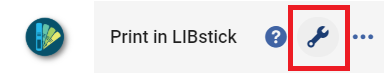
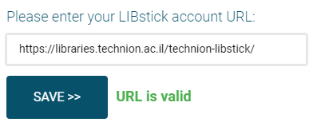
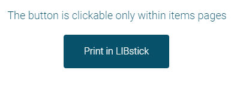
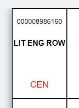
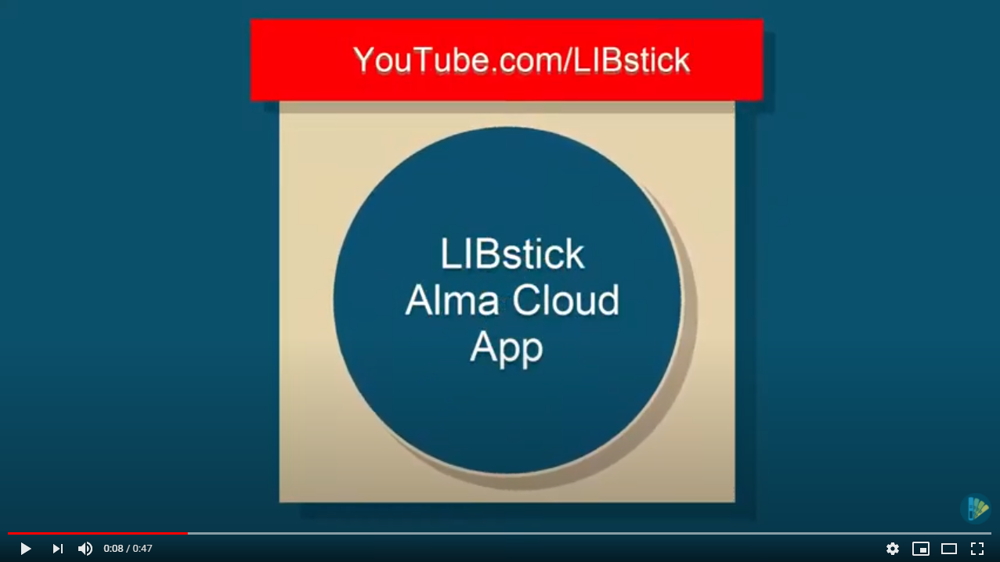

# Print in LIBstick

# Overview
### Print in one click directly from [Alma](https://www.exlibrisgroup.com/products/alma-library-services-platform/) screens to [LIBstick](https://libraries.technion.ac.il/libstick).

With "Print in LIBstick" Alma app you can send your physical items barcode/s and generate label/s directly from:
* Single **ITEM** page - send each time one label to LIBstick from "Physical Item Editor" Alma screen (**current** release)
* Single **SET** page - send Alma SET (either logical or itemized) from Alma to LIBstick (**future** releases)
* **ITEMS** search results page - send multiple labels from Alma to LIBstick (**current** releases)

# First time configuration
1. Download "Print in LIBstick" app from [Alma App Center](https://developers.exlibrisgroup.com/appcenter/).
2. Click the "Configuration" button:

3. Enter your LIBstick account URL (e.g. https://libraries.technion.ac.il/technion-libstick/):

4. Click the **SAVE** button - redirect you automatically to the main screen of the app.

**Note: The configuration will apply to the entire institute - only the first user need to enter the valid LIBstick account URL**

# Daily use
When entering relevant screens in Alma the "Print in LIBstick" button is enabled:

After clicking the button your LIBstick account will open in a new tab with the relevant label:

From now on, you can send more and more barcodes to LIBstick and generate labels:

**Note: "Print in LIBstick" is enabled only in the relevant screens in Alma.**

# YouTube

# Documentation
See the full LIBstick documentation in the following **[link](https://libraries.technion.ac.il/technion-libstick/wp-content/themes/technionlibraryemptytheme/libsticktemplate/doc/LIBstick_documentation.pdf)**

# Issues and defects
Please use the GitHub “Issues” to report defects

# License
[BSD 3-Clause License](./LICENSE)
